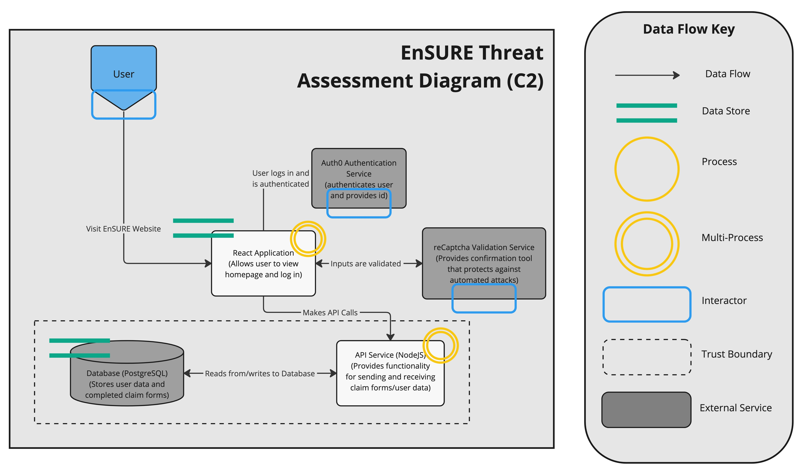

# PERN Stack application 

A mock insuranse claim website. Clients can file claims and review the status of their current claims. Admin can view review every claim and alter the status in the admin dashboard.

Login as client with client@blablabla.com, password: ClientPassword1
Login as admin with admin@blablabla.com, password: AdminPassword1

To run locally:
Required - Node, Docker
- Terminal commands:
  - docker-compose up -build
  - docker-compose exec api npm run db-migrations:up
  - see localhost:3000 in browser

## Run Tests
API test in server folder:
- npm install
- npm test

React tests in client folder:
- npm install
- npm test

# Features of note:

M.
- htt

##

User Flow Diagram

Threat Assessment Diagram

##

